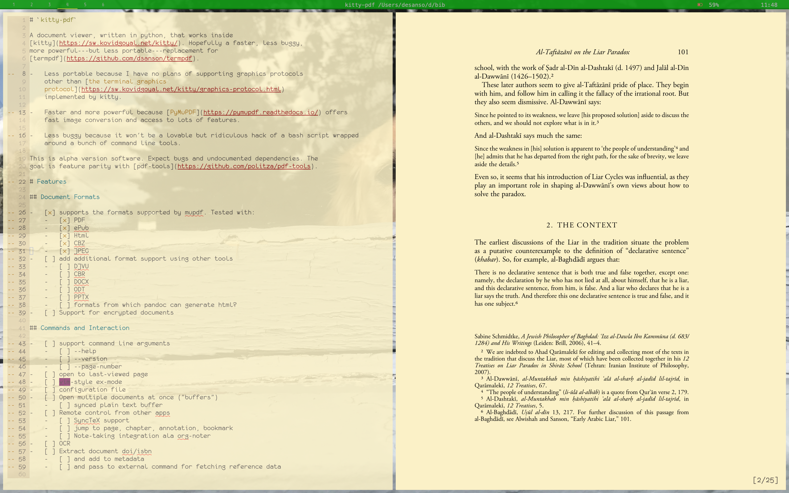

# `termpdf.py`

A document viewer, written in python, that works inside
[kitty](https://sw.kovidgoyal.net/kitty/). Hopefully a faster, less buggy,
more powerful---but less portable---replacement for
[termpdf](https://github.com/dsanson/termpdf).

-   Less portable because I have no plans of supporting graphics protocols
    other than [the terminal graphics
    protocol](https://sw.kovidgoyal.net/kitty/graphics-protocol.html)
    implemented by kitty.

-   Faster and more powerful because
    [PyMuPDF](https://pymupdf.readthedocs.io/) offers fast image conversion
    and access to lots of features.

-   Less buggy because it won't be a lovable but ridiculous hack of a bash
    script wrapped around a bunch of command line tools.

This is alpha software. Expect bugs. Expect changes. The
goal is feature parity with [pdf-tools](https://github.com/politza/pdf-tools).

# Screenshot

Note the alpha transparency. You can toggle this on or off by pressing `a`.

# Dependencies

-   Python 3
-   Kitty (unless other terminal emulators implement the same graphics protocol.)
-   [PyMuPDF](https://pypi.org/project/PyMuPDF/)
    -   PyMuPDF in turn depends on MuPDF. On OSX, `brew install mupdf-tools`.

# Installation

    git clone https://github.com/dsanson/termpdf.py
    cd termpdf.py
    pip install -r requirements.txt

(You might need to use `pip3` if `pip` is Python 2 on your system.)

Now you can run the script in place:

    ./termpdf.py <file.pdf>

Or copy it somewhere in your path.

Or you can install it with pip:

    pip install .

# Features

## Document Formats

-   [x] supports the formats supported by mupdf. Tested with:
    -   [x] PDF
    -   [x] ePub
    -   [x] Html
    -   [x] CBZ
    -   [x] JPEG
-   [ ] add additional format support using other tools
    -   [ ] DJVU
    -   [ ] CBR
    -   [ ] DOCX
    -   [ ] ODT
    -   [ ] PPTX
    -   [ ] formats from which pandoc can generate html?
-   [ ] Support for encrypted documents (should be trivial to add with
    pymupdf)

## Commands and Interaction

-   [ ] support command line arguments
    -   [x] --help
    -   [x] --version
    -   [x] --page-number 
    -   [x] --first-page
-   [x] remember last-viewed page and file state
-   [ ] vim-style ex-mode
-   [ ] configuration file
    -   [ ] configurable key mappings
    -   [x] basic configuration
-   [ ] Open multiple documents at once ("buffers")
-   [ ] Remote control from other apps
    -   [x] msgpack-rpc for interaction with nvim
        -   [x] send selected text to nvim buffer
        -   [x] send page number to buffer
        -   [ ] configurable format for text
        -   [ ] jump back from nvim to page in text
    -   [ ] SyncTeX support
    -   [ ] jump to page, chapter, annotation, bookmark
    -   [ ] Note-taking integration ala org-noter

## Navigation

-   [x] vim-style navigation
    -   [x] next-page, prev-page (with counts)
    -   [x] next-chapter, prev-chapter (with counts)
    -   [x] jump to page number
    -   [x] jump to beginning, end of document
-   [ ] logical page numbers
    -   [ ] read/write to PDF
    -   [x] simple page-offset setting
-   [x] navigate via table of contents
    -   [ ] outline folding support
-   [ ] Thumbnail mode
    -   [ ] Navigation
    -   [ ] Deleting pages
    -   [ ] Adding pages
    -   [ ] Moving pages within document
    -   [ ] Creating new document from selected pages
-   [x] Follow/fetch urls and internal links on page
-   [x] view document metadata
    -   [ ] edit metadata
    -   [x] update metadata from bibtex (requires that you set a citekey
            via the cli (`--citekey key`) and that you configure BIBTEX
            in the config file.

## Image Manipulation

-   [x] page rotation
    -   [ ] save rotation to PDF
-   [x] toggle transparency
-   [x] invert colors ("dark mode")
-   [x] toggle tinted background
-   [ ] Cropping and zooming
    -   [x] autocrop margins
    -   [ ] fit to width
    -   [ ] fit to height
    -   [ ] arbitrary zooming 
    -   [ ] panning
-   [x] Reflowing (for ePub and Html)

## PDF Manipulation

-   [ ] remove page(s) from PDF
-   [ ] combine PDFs
-   [ ] create new PDF from selected pages
-   [ ] move PDF pages
-   [ ] split two-up pages

## Notes, Annotations, Forms

-   [x] Send citation and current page number to nvim
-   [x] Send selected text with page number to nvim
-   [ ] Add and edit annotations
-   [ ] Extract annotations to org/markdown
-   [ ] Apply annotations from org/markdown
-   [ ] Fill out forms
    -   [ ] Document signing?

## Visual Mode 

-   [ ] Keyboard visual mode
    -   [x] Select by row
    -   [ ] Select by word
    -   [ ] Select by rectangle
    -   [x] Copy text selection: use the key 'y'
    -   [x] Insert selection in nvim buffer: use the key 'n'
    -   [x] Append selection to nvim_note file: use 'a'
    -   [ ] Copy selected image
    -   [ ] Crop to selection
    -   [ ] Insert annotation
-   [ ] Mouse mode
    -   [ ] Select by word
    -   [ ] Select by rectangle
    -   [ ] Copy text selection
    -   [ ] Copy image selection
    -   [ ] Insert annotation

